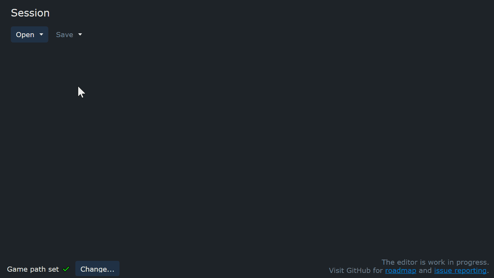

# Community Map Editor for Anno 1800

This project is not affiliated in any way with Ubisoft.

Anno 1800 is a trademark of Ubisoft Entertainment in the US and/or other countries.
Anno is a trademark of Ubisoft GmbH in the US and/or other countries.

The current version of the map editor is only useful if you know how to mod and work with extracted RDA files.

## Setup

You need to install [.NET 6](https://dotnet.microsoft.com/en-us/download/dotnet/6.0) to run the application.
It should prompt you to download it.

Once started, the editor will detect your game path automatically.
If it didn't find it, you'll need to set the path manually to your game or a folder with all RDA `data/` extracted.

## Features

- open map templates from the game, or extracted files (`.a7tinfo` and [FileDBReader](https://github.com/anno-mods/FileDBReader) `.xml`)
- rearrange islands, change island pool type
- save as ready-to-play mod (Old World in Sandbox mode only)
- save as map template for manual modding

## How to Use

Open an existing map, change it to your liking and safe it as a mod.
Only Old World maps can currently be saved as mod.
All other maps are only useful for modders.

Have a look at the [Modding Guide](https://github.com/anno-mods/modding-guide) if you need help how to create more complex map mods or even new sessions.

Sometimes you will see some warnings on the left side:

- Too many small/medium/large pool islands: The game uses every island variation only once.
  If you have too many pool islands, the game will just omit the remaining ones.

  Keep in mind, third party and pirate slots may turn into small islands depending on game settings.

## Roadmap

- change fixed islands type
- resize session
- fertilities, mine slots
- save Cap Trelawney, Arctic, Enbesa as mod
- save New World as mod mod after DLC12

There won't be a save as new region.
It's not reliable to do so without manual editing.

## Changelog

### 0.5

- Add, remove, change pool islands

### 0.4

- Move islands
- Save as playable mod (Old World only)

### 0.3

- Save/export to `.a7tinfo` and `.xml` files

### 0.2

- Open maps from game archives
- Auto-detect game data path

## Notes

This project uses:
- [RDAExplorer](https://github.com/jakobharder/RDAExplorer) (custom .NET6 build without WinForms)
- [FileDBReader](https://github.com/anno-mods/FileDBReader)
