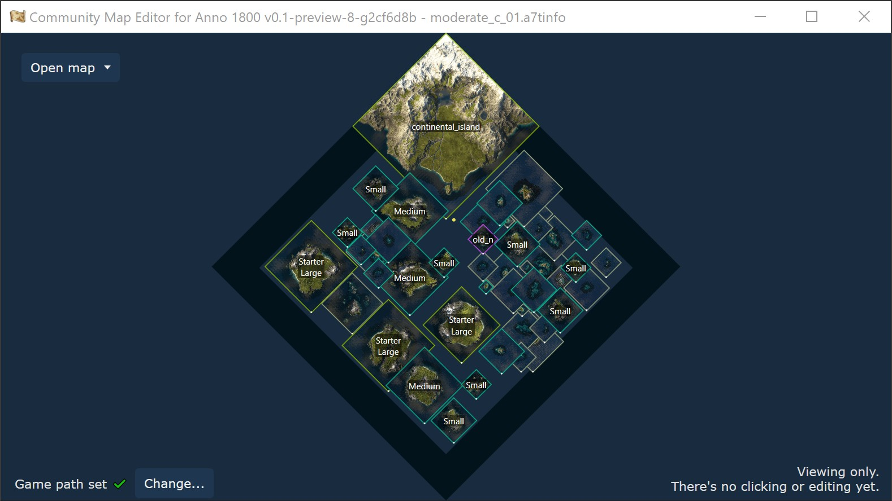

# Community Map Editor for Anno 1800

This project is not affiliated in any way with Ubisoft.

Anno 1800 is a trademark of Ubisoft Entertainment in the US and/or other countries.
Anno is a trademark of Ubisoft GmbH in the US and/or other countries.

The current version of the map editor is only useful if you know how to mod and work with extracted RDA files.

## Setup

You need to install [.NET 6](https://dotnet.microsoft.com/en-us/download/dotnet/6.0) to run the application.
It should prompt you to download it.

Once started, the editor will detect your game path automatically.
If it didn't find it, you'll need to set the path manually to your game or a folder with all RDA `data/` extracted.

## Features

- open, view and save `.a7tinfo` and [FileDBReader](https://github.com/anno-mods/FileDBReader) `.xml`
- open map templates directly from the `.rda` game archives

## Roadmap

- move, change islands
- add, remove islands
- resize session
- export as ready-to-play mod

## Changelog

### 0.3

- Save/export to `.a7tinfo` and `.xml` files

### 0.2

- Open maps from game archives
- Auto-detect game data path

## Notes

This project uses:
- [RDAExplorer](https://github.com/jakobharder/RDAExplorer) (custom .NET6 build without WinForms)
- [FileDBReader](https://github.com/anno-mods/FileDBReader)
